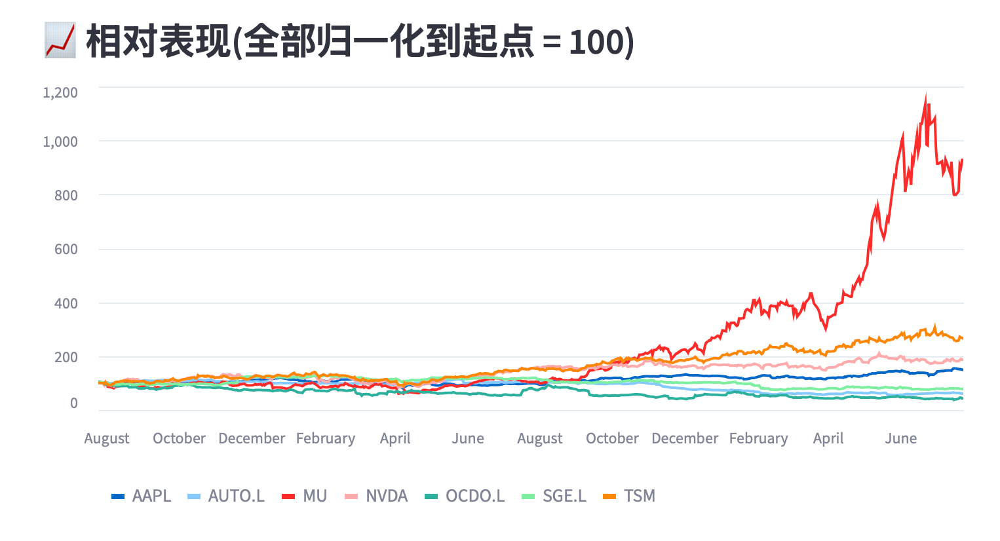
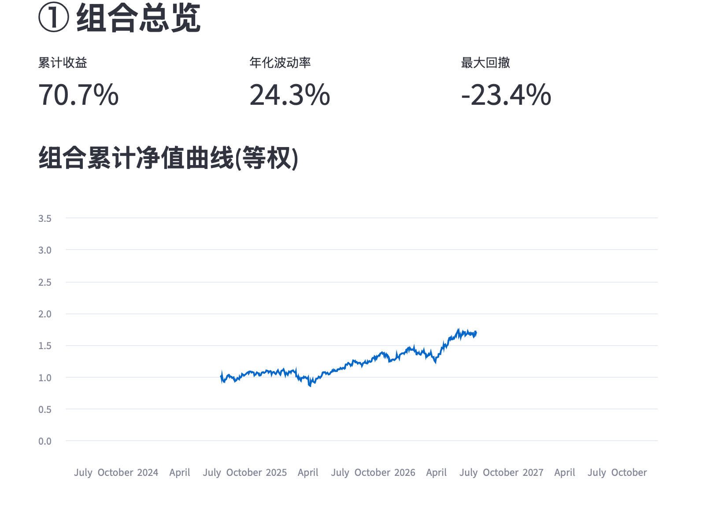

# UK & US Tech Stock Portfolio Dashboard 🇬🇧🇺🇸

An interactive dashboard for analysing a portfolio of UK and US technology
stocks — covering returns, volatility, drawdown, correlation and portfolio
optimisation. Built end-to-end in Python: data pipeline, analytics, and a
deployed web app.

> ⚠️ **Disclaimer:** This project is for educational purposes only and does
> not constitute investment advice.

## 🔗 Live Demo
https://uk-tech-isa-dashboard-sxdwvmtykunb53nkjmerpx.streamlit.app

## 📸 Screenshots



## ✨ Features

- **Portfolio Overview** — cumulative return curve and key metric cards
  (total return, annualised volatility, max drawdown) that update live as you
  adjust holding weights.
- **Single-Stock Analysis** — price with 20/50/200-day moving averages, plus a
  daily-return distribution histogram.
- **Risk Analysis** — correlation heatmap and portfolio drawdown ("underwater")
  curve.
- **Raw Data** — full price table with one-click CSV download.

## 🛠️ Tech Stack

- **Python** — core language
- **yfinance** — market data
- **Pandas / NumPy** — data cleaning and metric calculation
- **Plotly** — interactive charts
- **Streamlit** — web dashboard and deployment

## 📂 Project Structure

```
uk-tech-isa-dashboard/
├── src/
│   ├── fetch_data.py   # download, clean and cache price data
│   ├── analysis.py     # return / volatility / drawdown / correlation metrics
│   └── app.py          # Streamlit dashboard
├── requirements.txt
└── README.md
```

## 💡 What I Learned
- Handling yfinance offline behavior: Discovered that yfinance returns empty DataFrames silently during network outages rather than throwing errors—learned to explicitly validate returned data instead of relying solely on try/except blocks.
- Diversification in practice: Applied Modern Portfolio Theory (MPT) to demonstrate how portfolio diversification reduces overall volatility from an individual stock average of 42% down to 24%.
- Streamlit execution model & optimization: Mastered Streamlit's "rerun the entire script on every user interaction" paradigm, leveraging caching strategies for performance optimization.
- Cross-market data handling (UK & US): Managed cross-border dataset nuances, including currency unit mismatches (GBX pence vs. USD dollars), non-aligned market trading calendars, and utilizing returns as a inherently currency-comparable metric.

## ⚠️ Disclaimer

This dashboard is a personal learning project. All data comes from public
sources and may be delayed or inaccurate. Nothing here is investment advice.
Portfolio weights are hypothetical and do not reflect any real holdings.


